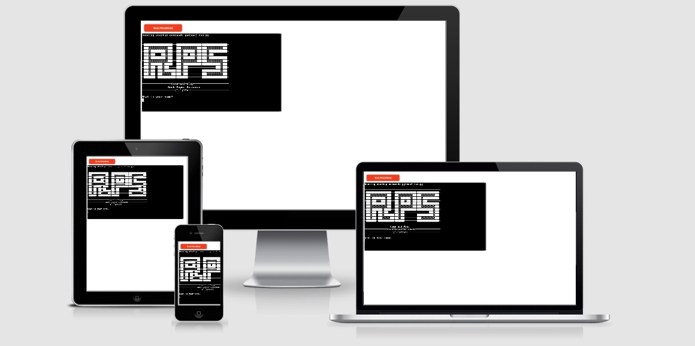
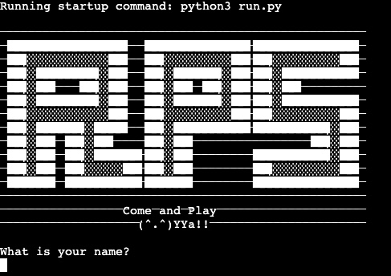
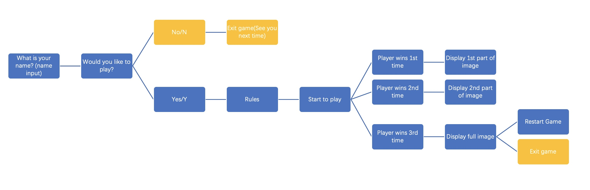
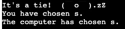
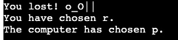
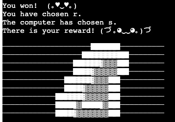
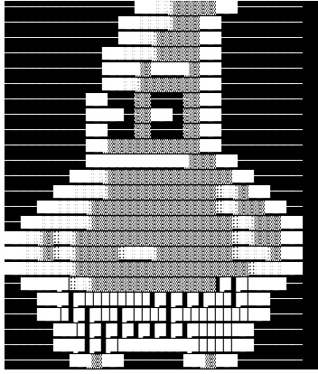
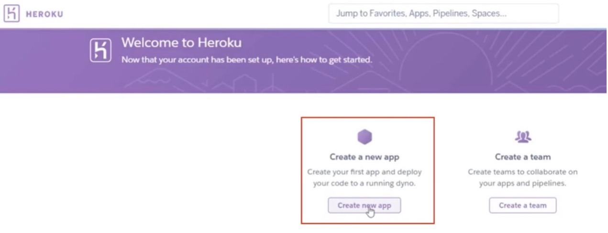
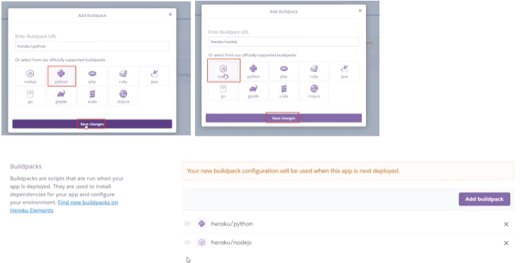
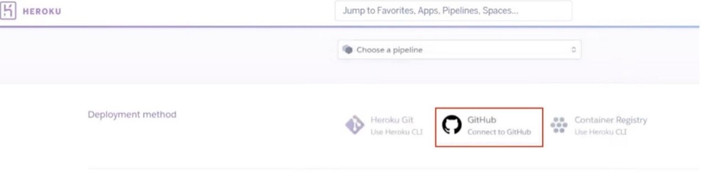

# [**Rock Paper Scissors**](https://rack-paper-scissors.herokuapp.com/)

## **Overview**

This is a Rock Paper Scissors game, created using Python language. It’s a fairly common game around the world. Basically, the computer randomly chooses Rock, Paper or Scissors and the player plays against to the computer. There are two possible outcomes: a draw, or a win for one player and a loss for the other. The rules are Rock beats Scissors, Paper beats Rock and Scissors beats Paper. The computer shows a partial picture each time the player wins. A full picture is displayed after 3 wins.

## **Table of Contents**

- [**Rock-Paper-Scissors**](#overview)
  - [**Overview**](#overview)
  - [**Table of Contents**](#table-of-contents)
    - [**1. What Is It?**](#1-what-is-it)
    - [**2. How to Achieve?**](#2-how-to-achieve)
    - [**3. Testing and Launch**](#3-testing-and-launch)
    - [**4. Deployment**](#4-deployment)
    - [**5. Support**](#5-support)
    - [**6. Reference and Research**](#6-reference-and-research)

### **1. What Is It?**

- The game of Rock Paper Scissors
[Details described on Wiki](https://en.wikipedia.org/wiki/Rock_paper_scissors)

Rock paper scissors (also known by other orderings of the three items, with "rock" sometimes being called "stone", or as Rochambeau, roshambo, or ro-sham-bo) is a hand game, usually played between two people, in which each player simultaneously forms one of three shapes with an outstretched hand. These shapes are "rock" (a closed fist), "paper" (a flat hand), and "scissors" (a fist with the index finger and middle finger extended, forming a V). "Scissors" is identical to the two-fingered V sign (also indicating "victory" or "peace") except that it is pointed horizontally instead of being held upright in the air.

A simultaneous, zero-sum game, it has only two possible outcomes: a draw, or a win for one player and a loss for the other. A player who decides to play rock will beat another player who has chosen scissors ("rock crushes scissors" or sometimes "blunts scissors"), but will lose to one who has played paper ("paper covers rock"); a play of paper will lose to a play of scissors ("scissors cuts paper"). If both players choose the same shape, the game is tied and is usually immediately replayed to break the tie. The type of game originated in China and spread with increased contact with East Asia, while developing different variants in signs over time.

Rock paper scissors is often used as a fair choosing method between two people, similar to coin flipping, drawing straws, or throwing dice in order to settle a dispute or make an unbiased group decision. Unlike truly random selection methods, however, rock paper scissors can be played with a degree of skill by recognizing and exploiting non-random behavior in opponents.

[Back to the top](#overview)

### **2. How to Achieve?**

- Features

  - **Welcome Page**

    RPS refers to Rock Paper Scissors. There is also a welcome message of “Come and Play” with a little cheerful happy face “(^.^)YYa!!”at the bottom. Finally, there is a question of “What is your name?” before starting the game. The game starts once the player enters their name.

    

    Once the player enters their name, the program greets the player and asks if they wish to play or exit the game. The game starts when the player enters a ‘y’and the game terminates if the player enters ‘n’.

- **Program flow chart**

    

    Firstly, the program obtains the player’s name and then greets the player.
    Secondly, the program asks the question “Would you like to play to play?” and takes input from the player to determine if the game continues or stops. If the player enters ‘n’, then the game is terminated. At the same time print out a goodbye message to the player. If the player enters ‘y’, then the game starts.
    The program displays rules after the input ‘y’ is identified and guides the player to make a move by entering 'r' for Rock, 'p' for Paper or 's' for Scissors.

    If the player wins, the computer displays a message and a partial image. Once the player has won 3 times, the computer displays a full image. Then the player is asked if they wish to replay the game or exit the game.

- **How to Play**

    The computer randomly chooses Rock, Paper or Scissors. The player can enter ‘r’ for Rock, ‘p’ for Paper or ‘s’ for Scissors to play against the computer. A player who decides to play rock will beat another player who has chosen scissors ("rock crushes scissors" or sometimes "blunts scissors"), but will lose to one who has played paper ("paper covers rock"); a play of paper will lose to a play of scissors ("scissors cuts paper"). If both players choose the same shape, the game is tied.
    If it’s a tie, the computer displays the following message:

    

    If the player loses, the computer displays the following message:

    

    If the player wins, the computer displays a message and a partial image as below:

    

    Once the player has won 3 time, the computer displays a full image as below:

    

    Then the player is asked if they wish to replay the game or exit the game.

[Back to the top](#overview)

### 3. **Testing and Launch**

- PEP8 validation

  - No errors or warnings were found when passing through the official PEP8 validator.

- Function start()
  - A bug was identified when testing on the start() function. There was a chance that a player may enter anything else other than y’ or ‘n. Hence used while…not in…: method to validate input and display a message to require the player to enter only ‘y’ or ‘n’ to start or exit the game.

- Function play()
  - The same bug fixed in play() function. The computer displays a message to the player if invalid input is identified.

- Technology Stack
  - [Python](https://www.python.org/)
  - [PEP8](http://pep8online.com/)
  - [Wiki](https://www.wikipedia.org/)
  - [Heroku]( https://dashboard.heroku.com/apps)

### 4. **Deployment**

- The game was deployed to [Heroku]( https://dashboard.heroku.com/apps) page. The steps to deploy are as follows:

- In the Heroku page, select ‘Create new app’

- Create app name and choose a region

- Navigate to the setting tab. Add Python and node.js buildpacks

- At the deploy section, connect to Github, search and link to Rock-Paper-Scissors repository.

- Scroll down to set up automatic deploys, it enables Heroku to rebuild the app every time push code to Github.

- The live link can be found here [link]( https://rack-paper-scissors.herokuapp.com/)

[Back to the top](#overview)

### 5. **Support**

- Mentor

  - [Daisy McGirr]( https://www.linkedin.com/in/daisy-mcgirr-4a3671173/)
  Full Stack Python (Django) Developer at PwC | Operate

  [Back to the top](#overview)

### 6. **Reference and Research**

- Reference
  - [Kylie Ying](https://www.youtube.com/watch?v=xRlN8CFJwAM&ab_channel=KylieYing)

[Back to the top](#overview)
